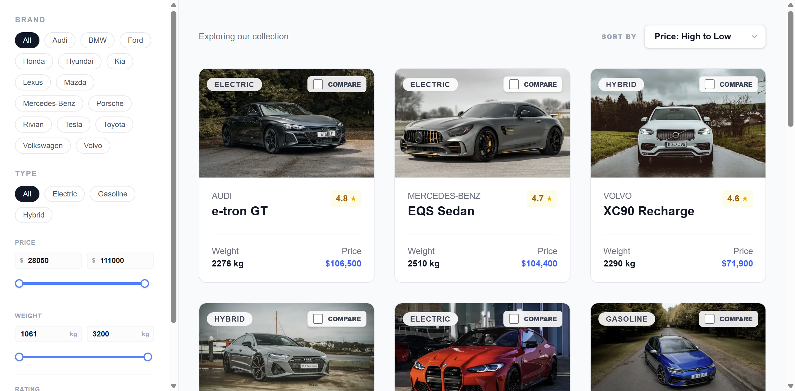
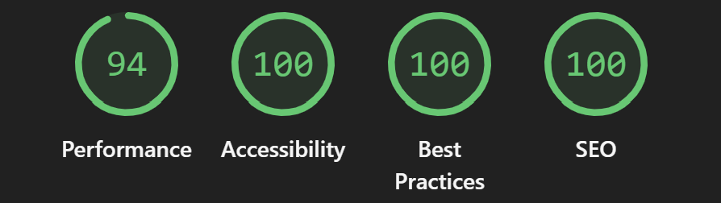

# 🏎️ AutoCompare | Premium Car Dashboard

<p align="center">
  
</p>
Car Comparison Dashboard is a high-performance, single-page car comparison application designed to provide a seamless user experience across all devices. The project focuses on speed, accessibility, and clean architectural patterns using the latest Next.js features.

<br>
<p align="center">
  
</p>
Lighthouse Score: 94% Performance | 100% Accessibility | 100% Best Practices | 100% SEO

---

## Tech Stack

- **Framework**: React.js and Next.js
- **Language**: TypeScript
- **Styling**: Tailwind CSS & Lucide Icons
- **Database**: PostgreSQL (via Server Actions)
- **Testing**: Vitest & React Testing Library
- **SEO**: Next.js Metadata API & Dynamic Sitemap

---

## Getting Started

### 1. Installation

# Clone the repository

```
git clone https://github.com/Pythongor/car-comparison-dashboard.git
```

# Install dependencies

```
npm install
```

### 2. Database Setup (Neon / Vercel Postgres)

This project uses PostgreSQL. To get the database running, follow the official [Next.js guide](https://nextjs.org/learn/dashboard-app/setting-up-your-database) to create a Vercel account, set up and connect to a Postgres database.

### 3. Seed the database

After the connection is established, populate the database with the initial car catalog by running:

```
npm run seed
```

### 4. Run the Project

Bash

```
# Development mode

npm run dev

# Production build (for best performance scores)

npm run build
npm run start
```

Live Preview: A hosted version of this project available at https://car-comparison-dashboard-lime.vercel.app/.

## Interface Overview

The application is a single-page dashboard that adapts fluidly to mobile, tablet, and desktop views.

- **Sidebar Filtering:** Real-time filtering by Brand, Engine Type (Electric, Petrol, etc.), Price range, Weight, and User Rating.

- **Car Grid:** A responsive grid featuring a search bar and detailed Car Cards showing key specs and high-quality imagery.

- **Comparison Tray:** A sticky footer tray that tracks selected cars. It manages the business logic of allowing a maximum of 4 cars for comparison.

- **Comparison Modal:** A side-by-side technical breakdown of selected vehicles to help users make informed decisions.

## Performance & Optimization

High performance is at the core of this project:

- **Optimized Images:** Utilizes next/image for automatic WebP conversion and resizing. A custom getOptimizedImage utility is used to append Unsplash-specific parameters (quality, width, and DPR) to ensure sharp visuals on Retina displays.

- **LCP Optimization:** Critical "above-the-fold" images are prioritized using fetchpriority="high" to ensure the Largest Contentful Paint happens as early as possible.

- **Zero Layout Shift:** Custom Skeleton Loaders are implemented to match the exact dimensions of car cards, ensuring a stable UI while data is fetching.

- **Smart Caching:** Server Actions are wrapped with React cache and Next.js unstable_cache to reduce database load and provide near-instant responses for frequent queries.

## Testing

I prioritize code reliability using Vitest and React Testing Library.

Running Tests

```
# Run all tests

npm run test

# Run tests in watch mode

npm run test:watch
```

Testing Coverage includes:

- **Utility Testing:** Verification of URL parameter handling and image optimization logic.

- **Component Integration:** Ensuring the Comparison Context correctly handles car selection limits.

## SEO Optimizations

Even as a single-page app, SEO is fully optimized:

- **Metadata API:** Tailored Title, Description, and OpenGraph tags for social sharing.

- **Semantic HTML:** Proper use of `<main>`, `<aside>`, and `<h1-h3>` hierarchies.

- **Technical SEO:** Automatically generated sitemap.xml and robots.txt to guide search engine crawlers.

- **Core Web Vitals:** Optimized for Google's latest ranking signals (LCP, INP, and CLS).
